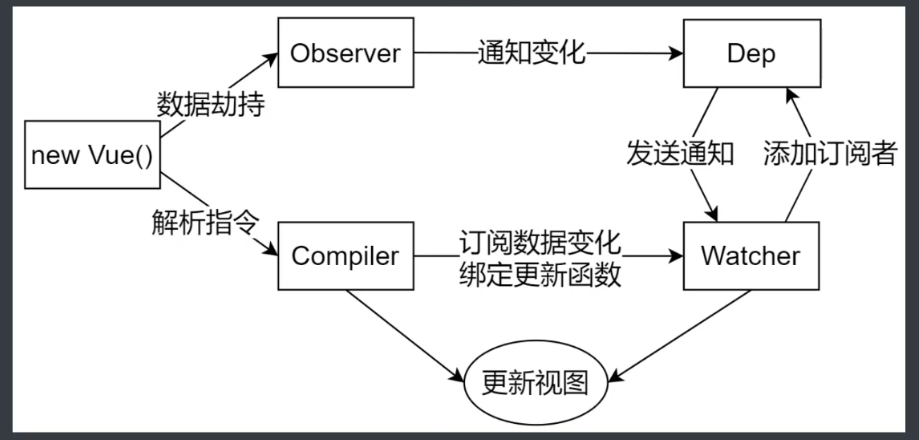
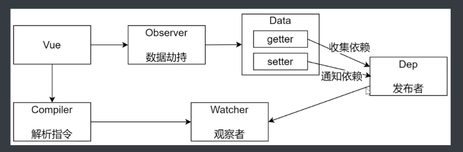
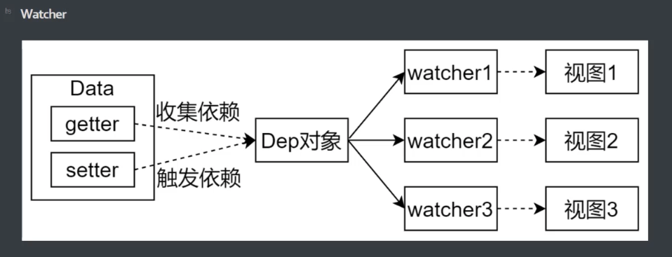

# Vue.js响应式原理
- 给vue实例中的data对象动态新增成员时，由于没有经过observer处理，所以改成员不是响应式的
## 数据驱动
- 数据响应式    
    - 数据模型仅仅是普通的JavaScript对象，当修改数据时，视图会进行更新，避免了繁琐的DOM操作，提高开发效率
- 双向绑定
    - 数据改变，视图改变；视图改变，数据也随之改变
    - 可以使用v-model在表单元素上创建双向数据绑定
- 数据驱动：Vue最独特的特性之一
    - 开发过程中仅需要关注数据本身，不需要关心数据是如何渲染到视图

## 数据响应式的核心原理
### Vue 2.x
- 浏览器兼容IE8以上
- 基于Object.defineProperty()，来劫持对象中的属性，给属性添加setter/getter，每一个属性创建一个dep对象，dep负责收集依赖，在数据变动时dep对象通知watcher对象，watcher内部负责更新视图
```
<!DOCTYPE html>
<html lang="en">
<head>
    <meta charset="UTF-8">
    <meta name="viewport" content="width=device-width, initial-scale=1.0">
    <title>Document</title>
</head>
<body>
    <div id="app">
        test
    </div>

    <script>
        // 模拟Vue中data选项
        let data = {
            msg: 'test',
            count: 100
        }

        // 模拟Vue实例
        let vm = {}

        // 数据劫持：当访问或者设置vm中的成员时，做一些干预
        Object.keys(data).forEach(key => {
            Object.defineProperty(vm, key, {
                // 可枚举（可遍历）
                enumerable: true,
                // 可配置（可使用delete删除，可以通过defineProperty重新定义）
                configurable: true,
                // 当获取的时候执行
                get () {
                    return data[key]
                },
                set (newValue) {
                    if (newValue === data[key]) {
                        return
                    }
                    data[key] = newValue
                    document.getElementById('app').innerHTML = data[key]
                }
            })
        })
        
    </script>
</body>
</html>
```

### Vue 3.x
- 基于Proxy代理对象来监听数据的变化，不需要再为每一个属性添加setter/getter
- 直接监听对象，而非属性
- ES6中新增，IE不支持，性能由浏览器优化
```
<!DOCTYPE html>
<html lang="en">
<head>
    <meta charset="UTF-8">
    <meta name="viewport" content="width=device-width, initial-scale=1.0">
    <title>Document</title>
</head>
<body>
    <div id="app">
        test
    </div>

    <script>
        // 模拟Vue中data选项
        let data = {
            msg: 'test',
            count: 100
        }

        // 模拟Vue实例
        let vm = new Proxy(data, { // 执行代理行为的函数，当访问vm的成员会执行
            get (target, key) {
                return target[key]
            },
            set (target, key, newValue) {
                if (newValue === target[key]) {
                    return
                }
                target[key] = newValue
                document.getElementById('app').innerHTML = target[key]
            }
        })

    </script>
</body>
</html>
```

## 发布订阅模式和观察者模式
- 发布订阅模式由统一调度中心调用，因此发布者和订阅者不需要知道对方的存在
- 观察者模式是由具有目标调度，比如当时间触发，Dep就会去调用观察者的方法，所以订阅者（观察者）和发布者（目标）之间是存在依赖关系的

### 发布订阅模式
- 订阅者、发布者、信号中心
- 我们假定，存在一个信号中心，某个任务执行完成，就向信号中心发布一个信号，其他任务就可以向信号中心订阅这个信号，从而知道什么时候自己可以开始执行
- 比如：学生考完试，家长天天问考试结果，这时候家长可以去学生班级去订阅考试成绩，留下联系方式，等成绩一出来，老师就通过短信的方式通知各位家长
    - 这个过程中，家长就是订阅者，老师就是发布者，学生班级就是信号中心
```
// 事件触发器
class EventEmitter {
    constructor () {
        this.subs = {} // { 'click': [fn1, fn2], 'change': [fn1] }
    }

    // 注册事件
    $on (eventType, handler) {
        this.subs[eventType] = this.subs[eventType] || []
        this.subs[eventType].push(handler)
    }

    // 触发事件
    $emit (eventType) {
        if (this.subs[eventType]) {
            this.subs[eventType].forEach(handler => {
                handler()
            })
        }
    }
}

let em = new EventEmitter()
em.$on('click', () => {
    console.log('click1')
})
em.$on('click', () => {
    console.log('click2')
})
em.$emit('click')
```

### 观察者模式
- 观察者（订阅者）：Watcher
- 目标（发布者）：Dep
- 没有事件中心
```
// 目标
class Dep {
    constructor () {
        // 记录所有订阅者
        this.subs = []
    }

    // 添加订阅者
    addSub (sub) {
        if (sub && sub.update) {
            this.subs.push(sub)
        }
    }

    // 发布通知
    notify () {
        this.subs.forEach(sub => {
            sub.update()
        })
    }
}

// 订阅者
class Watcher {
    update () {
        console.log('update')
    }
}

let dep = new Dep()
let watcher = new Watcher()
dep.addSub(watcher)
dep.notify()
```

## Vue

- 功能
    - 负责接收初始化的参数（选项）
    - 负责把data中的属性注入到Vue实例，转换成getter/setter
    - 负责调用observer监听data中所有属性的变化
    - 负责调用compiler解析指令/差值表达式
- 结构
    - $options【记录构造函数传递的参数】
    - $el【记录构造函数传递的参数】
    - $data【记录构造函数传递的参数】
    - _proxyData()【把data中的属性转换成getter/setter，注入到Vue实例中】
```
class Vue {
    constructor (options) {
        // 1）通过属性保存选项的数据
        this.$options = options || {}
        this.$data = options.data || {}
        this.$el = typeof options.el === 'string' ? document.querySelector(options.el) : options.el

        // 2）把data中的成员转换成getter/setter，注入到Vue实例中
        this._proxyData(this.$data)

        // 3）调用observer对象，监听数据变化
        new Observer(this.$data)

        // 4）调用compile对象，解析指令和差值表达式
        new Compiler(this)
    }

    _proxyData (data) {
        Object.keys(data).forEach(key => {
            Object.defineProperty(this, key, {
                enumerable: true,
                configurable: true,
                get () {
                    return data[key]
                },
                set (newValue) {
                    if (newValue === data[key]) {
                        return
                    }
                    data[key] = newValue
                }
            })
        })
    }
}
```

## Observer
- 功能
    - 负责把data选项中的属性转换成响应式数据
    - data中的某个属性也是对象，把该属性转换成响应式数据
    - 数据变化发送通知
- 结构
    - walk(data)【遍历data中的所有属性】
    - defineReactive(data,key,value)【定义响应式数据，把属性转换成getter/setter】
```
class Observer {
    constructor (data) {
        this.walk(data)
    }

    // 遍历data中所有属性
    walk (data) {
        if (!data || typeof data !== 'object') {
            return
        }   
        Object.keys(data).forEach(key => {
            this.defineReactive(data, key, data[key])
        })
    }

    // 把属性转换成getter/setter
    defineReactive (obj, key, value) {
        let _this = this;
        // 负责收集依赖并发送通知
        let dep = new Dep()

        // 如果 val 是对象，继续设置它下面的成员为响应式数据
        this.walk(value)
        
        Object.defineProperty(obj, key, {
            enumerable: true,
            configurable: true,
            get () {
                Dep.target && dep.addSub(Dep.target) // 收集依赖
                return value
            },
            set (newValue) {
                if (newValue === obj[key]) {
                    return
                }
                //如果 newValue 是对象，设置 newValue 的成员为响应式
                _this.walk(newValue)
                value = newValue

                // 发送通知
                dep.notify()
            }
        })
    }
}
```

## Compiler
- 功能
    - 负责编译模板，解析指令/差值表达式
    - 负责页面的首次渲染
    - 当数据变化后重新渲染视图
- 结构
    - el【options里面传递el】
    - vm【vue的实例】
    - compile(el)【遍历Dom元素的所有节点，判断节点是文本节点->解析差值表达式，是元素节点->解析指令】
    - compileElement(node)【解析指令】
    - compileText(node)【解析差值表达式】
    - isDirective(attrName)【判断当前属性是否是指令】
    - isTextNode(node)【判断节点类型】
    - isElementNode(node)【判断节点类型】
```
class Compiler {
    constructor (vm) {
        this.el = vm.$el
        this.vm = vm
        this.compile(this.el)
    }

    // 编译模板，处理文本节点和元素节点
    compile (el) {
        let childNodes = el.childNodes
        Array.from(childNodes).forEach(node => {
            if (this.isTextNode(node)) { // 处理文本节点
                this.compileText(node)
            } else if (this.isElementNode(node)) { // 处理元素节点
                this.compileElement(node)
            }

            // 判断node节点是否有子节点，如果有，则递归调用compile
            if (node.childNodes && node.childNodes.length) {
                this.compile(node)
            }
        })
    }

    // 编译元素节点，处理指令
    compileElement (node) {
        // 遍历所有的属性节点，判断是否为指令->
        Array.from(node.attributes).forEach(attr => {
            let attrName = attr.name
            if (attrName && this.isDirective(attrName)) {
                // v-text --> text v-model --> model
                attrName = attrName.substr(2)
                let key = attr.value
                this.update(node, key, attrName)
            }
        })
    }

    update (node, key, attrName) {
        let updateFn = this[attrName + 'Updater']
        updateFn && updateFn.call(this, node, this.vm[key], key)
    }

    // 处理v-text指令
    textUpdater (node, value, key) {
        node.textContent = value

        // 创建watcher对象，当数据改变时更新视图
        new Watcher(this.vm, key, (newValue) => {
            node.textContent = newValue
        })
    }

    // 处理v-model指令
    modelUpdater(node, value, key) {
        node.value = value

        // 创建watcher对象，当数据改变时更新视图
        new Watcher(this.vm, key, (newValue) => {
            node.value = newValue
        })

        // 双向绑定，给元素绑定input事件，当视图value改变时-->改变vm中对用key的值
        node.addEventListener('input', () => {
            this.vm[key] = node.value
        })
    }

    // 编译文本节点，处理差值表达式
    compileText (node) {
        // {{ msg }}
        let reg = /\{\{(.+?)\}\}/
        let value = node.textContent
        if (reg.test(value)) {
            let key = RegExp.$1.trim()
            node.textContent = value.replace(reg, this.vm[key])

            // 创建watcher对象，当数据改变时更新视图
            new Watcher(this.vm, key, (newValue) => {
                node.textContent = newValue
            })
        }
    } 

    // 判断元素属性是否是指令
    isDirective (attrName) {
        return attrName.startsWith('v-')
    }

    // 判断节点是否是文本节点
    isTextNode (node) {
        return node.nodeType === 3
    }

    // 判断节点是否是元素节点
    isElementNode (node) {
        return node.nodeType === 1
    }
}
```

## Dep(Dependency)

- 功能
    - 手机依赖，添加观察者（watcher）
    - 通知所有观察者
- 结构
    - subs【存储所有watcher】
    - addSub(sub)【添加watcher】
    - notify()【发布通知】
```
class Dep {
    constructor () {
        this.subs = [] // 存储所有观察者
    }

    // 添加观察者
    addSub (sub) {
        if (sub && sub.update) {
            this.subs.push(sub)
        }
    }

    // 发布通知
    notify () {
        this.subs.forEach(sub => {
            sub.update()
        })
    }
}
```

## Watcher

- 功能
    - 当数据变化触发依赖，dep通知所有的watcher实例更新视图
    - 自身实例化的时候往dep对象中添加自己
- 结构
    - vm【vue实例】
    - key【data里属性名称】
    - cb【回调函数，指明如何更新视图】
    - oldValue【数据变化之前的值】
    - update()【更新视图】
```
class Watcher {
    constructor (vm, key, cb) {
        this.vm = vm; // vue实例
        this.key = key; // data里的属性名称
        this.cb = cb; // 回调函数，指明如何更新视图

        // 将Watcher对象记录到Dep类的静态属性target
        // 触发get方法，在get方法中会调用addSub
        // 将Dep.target设为空，防止重复添加
        Dep.target = this;

        this.oldValue = vm[key]

        Dep.target = null
    }

    // 当数据发生变化的时候去更新视图
    update () {
        let newValue = this.vm[this.key]
        if (newValue === this.oldValue) {
            return
        }
        this.cb(newValue)
    }
}
```
    