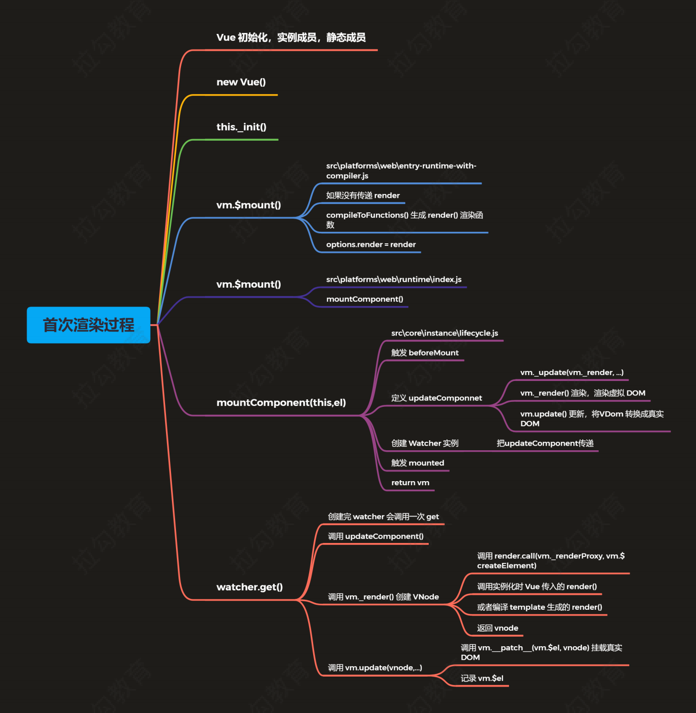

# Vue源码解析

## 响应式原理
### 目录结构
#### src
- compiler 编译相关 
- core Vue 核心库 
- platforms 平台相关代码 
- server SSR，服务端渲染 
- sfc .vue 文件编译为 js 对象 
- shared 公共的代码

### 打包工具
#### Rollup
- Vue.js 源码打包工具使用的是 Rollup，比 Webpack 轻量
- Webpack 把所有文件当做模块，Rollup 只处理 js 文件更适合在 Vue.js 这样的库中使用
- Rollup 打包不会生成冗余的代码

### Vue 不同版本的构建
- 官方文档：https://cn.vuejs.org/v2/guide/installation.html#%E5%AF%B9%E4%B8%8D%E5%90%8C%E6%9E%84%E5%BB%BA%E7%89%88%E6%9C%AC%E7%9A%84%E8%A7%A3%E9%87%8A

#### 术语
- 完整版：同时包含编译器和运行时的版本。
- 编译器：用来将模板字符串编译成为 JavaScript 渲染函数的代码，体积大、效率低。
- 运行时：用来创建 Vue 实例、渲染并处理虚拟 DOM 等的代码，体积小、效率高。基本上就是除去编译器的代码。
- UMD：UMD 版本通用的模块版本，支持多种模块方式。 vue.js 默认文件就是运行时 + 编译器的UMD 版本
- CommonJS(cjs)：CommonJS 版本用来配合老的打包工具比如 Browserify 或 webpack 1。
- ES Module：从 2.6 开始 Vue 会提供两个 ES Modules (ESM) 构建文件，为现代打包工具提供的版本。
    - ESM 格式被设计为可以被静态分析，所以打包工具可以利用这一点来进行“tree-shaking”并将用不到的代码排除出最终的包。
    - ES6：https://es6.ruanyifeng.com/#README

#### Runtime + Compiler vs. Runtime-only
```
// Compiler 
// 需要编译器，把 template 转换成 render 函数 
// const vm = new Vue({ 
    // el: '#app', 
    // template: '<h1>{{ msg }}</h1>', 
    // data: { 
        // msg: 'Hello Vue' 
        // } 
        // }) 
// Runtime 
// 不需要编译器 
const vm = new Vue({ 
    el: '#app', 
    render (h) { return h('h1', this.msg) },
    data: { msg: 'Hello Vue' } }) 
```
- 推荐使用运行时版本，因为运行时版本相比完整版体积要小大约 30%
- 基于 Vue-CLI 创建的项目默认使用的是 vue.runtime.esm.js
    - 通过查看 webpack 的配置文件
    ```
    vue inspect > output.js
    ```

### 入口文件
- src/platform/web/entry-runtime-with-compiler.js

#### 查看源码，若同时存在 template 和 render，渲染结果？
```
// 如果同时设置template和render此时会渲染什么？--> 只会渲染render中的内容
const vm = new Vue({
    el: '#app',
    template: '<h1>Hello Template</h1>',
    render(h) {
    return h('h1', 'Hello Render')
    }
})
``` 
- el 不能是 body 或者 html 标签
- 如果没有 render，把 template 转换成 render 函数
- 如果有 render 方法，直接调用 mount 挂载 DOM
```
// el 不能是 body 或者 html
  if (el === document.body || el === document.documentElement) {
    process.env.NODE_ENV !== 'production' && warn(
      `Do not mount Vue to <html> or <body> - mount to normal elements instead.`
    )
    return this
  }

  const options = this.$options
  // resolve template/el and convert to render function
  // 把 template/el 转换成 render 函数
  if (!options.render) {
    // 把 template/el 转换成 render 函数
    
  }
  // 调用 mount 方法，渲染 DOM
  return mount.call(this, el, hydrating)
}
```

### Vue初始化过程
#### 四个导出Vue的模块
- src/platforms/web/entry-runtime-with-compilerjs
  - web平台相关的入口
  - 重写了平台相关的$mount()方法
  - 注册了Vue.compile()方法，传递一个HTML字符串返回render函数
- src/platforms/web/runtime/index.js
  - web平台相关
  - 注册和平台相关的全局指令: v-model、 v-show
  - 注册和平台相关的全局组件: v- transition,v-transition-group
  - 全局方法：
    - _patch_: 把虚拟DOM转换成真实DOM
    - $mount:挂载方法
- src/core/index.js
  - 与平台无关
  - 设置了Vue的静态方法，initGlobalAPl(Vue)
- src/core/instance/index.js
  - 与平台无关
  - 定义了构造函数，调用了this.init(options) 方法
  - 给Vue中混入了常用的实例成员

#### 静态方法
- ./src/core/global-api/index.js
```
 // 设置keep-alive组件
  extend(Vue.options.components, builtInComponents)

  // 注册Vue.use()用来注册组件
  initUse(Vue)
  // 注册Vue.mixin()实现混入
  initMixin(Vue)
  // 注册Vue.extend()基础传入的options返回一个组件的构造函数
  initExtend(Vue)
  // 注册Vue.directive()、Vue.component()、Vue.filter()
  initAssetRegisters(Vue)
```

#### 实例成员
- ./src/core/instance/index.js
```
// 注册vm的_init()方法，初始化vm
initMixin(Vue)
// 注册vm的$data/$props/$set/$delete/$watch
stateMixin(Vue)
// 初始化事件相关方法
// $on/$once/$off/$emit
eventsMixin(Vue)
// 初始化生命周期相关的混入方法
// _update/$forceUpdate/$destroy
lifecycleMixin(Vue)
// 混入render
// $nextTick/_render
renderMixin(Vue)
```

#### 构造函数
- 构造函数中调用了init方法
- ./src/core/instance/init.js
```
// vm的生命周期相关变量初始化
// $children/$parent/$root/$refs
initLifecycle(vm)
// vm的事件监听初始化，父组件绑定在当前组件上的事件
initEvents(vm)
// vm的编译render初始化
// $slots/$scopedSlots/_c/$createElement/$attrs/$listeners
initRender(vm)
// beforeCreate 生命钩子回调
callHook(vm, 'beforeCreate')
// 把inject的成员注入到vm上
initInjections(vm) // resolve injections before data/props
// 初始化vm的_props/methods/_data/computed/watch
initState(vm)
// 初始化provide
initProvide(vm) // resolve provide after data/props
// created 生命钩子的回调
callHook(vm, 'created')
```

#### 首次渲染过程

- 首先进行Vue的初始化，也就是初始化Vue的实例成员以及静态成员
- 当初始化结束之后，开始调用构造函数，在构造函数中调用this._init()，这个方法相当于我们整个Vue的入口
- 在_init()中最终调用了this.$mount()，共有两个$mount()
  - 第一个$mount()是entry-runtime-with-compiler.js入口文件的$mount()。核心作用：把模板编译成render函数。
  - 执行过程：
    - 首先会判断一下我们当前是否传入了render选项，如果没有传入的话，它会去获取我们的template选项
    - 如果template选项也没有的话，会把el中的内容作为模板，然后把模板编译成render函数
    - 通过compileToFunctions()函数，把模板编译成render函数的,当把render函数编译好之后，把render函数存在options.render中
  - 第二个会调用runtime/index.js中的$mount()方法。
    - 首先会重新获取el，因为如果是运行时版本的话，是不会entry-runtime-with-compiler.js这个入口中获取el，所以如果是运行时版本的话，会在runtime/index.js的$mount()中重新获取el
- 调用mountComponent(),是在src/core/instance/lifecycle.js中定义的
  - 首先会判断render选项，如果没有但是传入了模板，并且当前是开发环境的话会发送警告，警告运行时版本不支持编译器
  - 触发beforeMount这个生命周期中的钩子函数，也就是开始挂载之前
  - 定义了updateComponent()，定义了_render和_update，_render的作用是生成虚拟DOM，_update的作用是将虚拟DOM转换成真实DOM，并且挂载到页面上来
- 创建Watcher对象
  - 在创建Watcher时，传递了updateComponent这个函数，这个函数最终是在Watcher内部调用的
  - 在Watcher创建完之后还调用了get方法，在get方法中，会调用updateComponent()

### 响应式处理过程
- initState() --> initData() --> observe()

- observe(value)
  - 位置：src/core/observer/index.js
  - 功能：
    - 判断value是否是对象，如果不是对象直接返回
    - 判断value对象是否有__ob__,如果有直接返回
    - 如果没有，创建observer对象
    - 返回observer对象

- Observer
  - 位置：src/core/observer/index.js
  - 功能：
    - 给value对象定义不可枚举的__ob__属性，记录当前的observer对象
    - 数组的响应式处理
    - 对象的响应式处理，调用walk方法

- defineReactIve
  - 位置：src/core/observer/index.js
  - 功能：
    - 为每一个属性创建dep对象
    - 如果当前属性的值是对象，调用observe
    - 定义getter
      - 收集依赖
      - 返回属性的值
    - 定义setter
      - 保存新值
      - 如果新值是对象，调用observe
      - 派发更新（发送通知），调用dep.notify()

- 收集依赖
  - 在watcher对象的get方法中调用pushTarget记录Dep.target属性
  - 访问data中的成员的时候收集依赖，defineReactive的getter中收集依赖
  - 把属性对应的watcher对象添加到dep的subs数组中
  - 给childOb收集依赖，目的是子对象添加和删除成员时发送通知

- Watcher
  - dep.notify()在调用watcher对象的update()方法
  - queueWatcher()判断watcher是否被处理，如果没有的话添加到queue队列中，并调用flushScheduleQueue()
  - flushScheduleQueue()
    - 触发beforeUpdate钩子函数
    - 调用watcher.run()： run() --> get() --> getter() --> updateComponent
    - 清空上一次的依赖
    - 触发actived的钩子函数
    - 触发updated钩子函数

### 添加一个响应式属性
- Vue.set()定义位置：global-api/index.js
```
// 静态方法：set/delete/nextTick
  Vue.set = set
  Vue.delete = del
  Vue.nextTick = nextTick
```

- vm.$set()定义位置：instance/index.js
```
// 注册vm的$data/$props/$set/$delete/$watch
stateMixin(Vue)

// instance/state.js
Vue.prototype.$set = set
```

- 使用：Vue.set(target, attrName, attrValue)或vm.$set(target, attrName, attrValue)
  - 例如：Vue.set(vm.obj, 'name', 'zhangsan')
  - 注意：目标对象不能是一个Vue实例或Vue实例的根数据对象

### 删除一个响应式属性
- Vue.delete()
- vm.$delete()
- 如果对象时响应式的，确保删除能触发更新视图。这个方法主要用于避免Vue不能检测到属性被删除的限制
- 使用：  
  - vm.$delete(vm.obj, 'msg') 或Vue.delete(vm.obj, 'msg')
  - 注意：目标对象不能是一个Vue实例或Vue实例的根数据对象