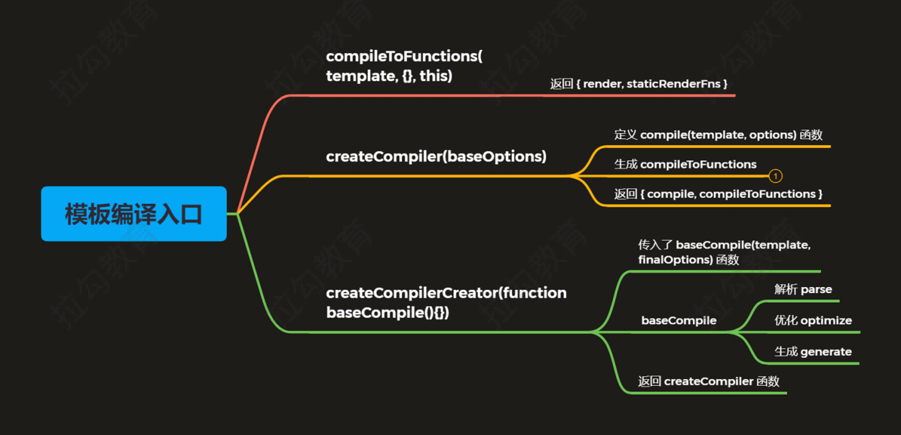
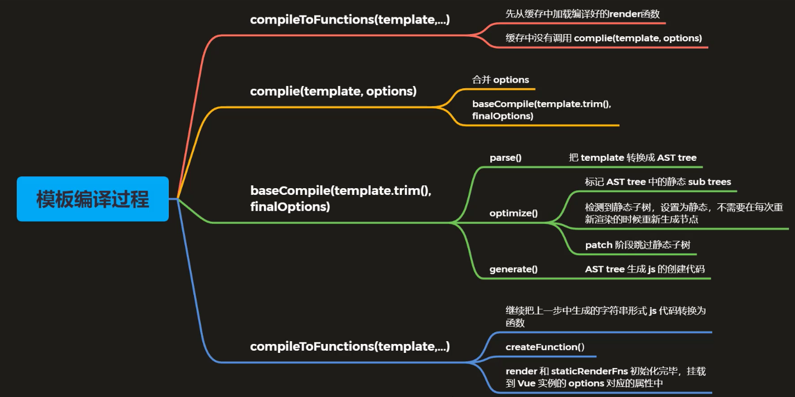

# Vue源码分析
## 模板编译
- 主要目的是将模板（template）转换成渲染函数（render）
```
<div>
  <h1 @click="handler">
    title
  </h1>
  <p>
		some content    
  </p>
</div>
```
- 渲染函数
```
render (h) {
  return h('div', [
    h('h1', { on: { click: this.handler } }, 'title'),
    h('p', 'some content')
  ])
}
```
- 作用：
    - Vue 2.x 使用 VNode 描述视图以及各种交互，用户自己编写 VNode 比较复杂
    - 用户只需要编写类似 HTML 的代码 - Vue 模板，通过编译器将模板转换为返回 VNode 的 render 函数
    - .vue 文件会被 webpack 在构建的过程中转换成 render 函数

### 体验模板编译的结果
#### 编译生成的函数的位置
- _c()
    - src/core/instance/render.js
- _m()/_v()/_s()
    - src/core/instance/render-helpers/index.js

#### 模板编译的结果
```
(function anonymous() {
  with (this) {
    return _c(
    	"div",
      { attrs: { id: "app" } },
      [
        _m(0), // 静态标签
        _v(" "), // 节点之间的空白字符
        _c("p", [_v(_s(msg))]), // _s是转换成字符串
        _v(" "),
        _c("comp", { on: {myclick: handler } }), // 自定义模板
      ],
      1 // 1表示如果是二维数组，会进行拍平
    )
  }
})
```

#### Vue Template Explorer
- 这是一个网页工具，是将HTML模板转换为render函数
- Vue2网址是：https://template-explorer.vuejs.org/
- Vu3网址是：https://vue-next-template-explorer.netlify.app/
- Vue对render函数做了优化，此外Vue2中的模板中尽量不要出现多余的空白，因为都会被转换到render函数中，Vue3的模板中的空白则不影响render函数

### 模板编译的入口


### 模板编译的过程
#### 模板编译入口
- 位置：src/compiler/create-compiler.js
- createCompilerCreator 函数返回了 compile 对象和 compileToFunctions 函数
- 模板和插值表达式在编译的过程中都会被转换成对应的代码形式，不会出现在 render 函数中

#### 模板编译过程 - compileToFunctions
- 位置：src/compiler/create-compiler.js
- 模板编译的入口函数 compileToFunctions() 中的 generate 函数的作用是把优化后的 AST 转换成代码

#### 模板编译过程 - compile
- 位置：src/compiler/create-compiler.js
- 核心作用：合并选项，调用 baseCompile 进行编译，记录错误，返回编译好的对象

#### 模板编译过程 - baseCompile - AST
- 位置：src/compiler/index.js
- 在 createCompilerCreator 函数中
    - 首先用 parse 函数把模板转换成 AST 抽象语法树
    - 然后使用 optimize 函数优化抽象语法树
    - 再用 generate 函数把抽象语法书生成字符串形式的 js 代码
```
export const createCompiler = createCompilerCreator(function baseCompile (
  template: string,
  options: CompilerOptions
): CompiledResult {
  // 把模板转换成ast抽象语法树
  // 抽象语法树，用来以树形的方式描述代码结构
  const ast = parse(template.trim(), options)
  if (options.optimize !== false) {
    // 优化抽象语法树
    optimize(ast, options)
  }
  // 把抽象语法书生成字符串形式的js代码
  const code = generate(ast, options)
  return {
    ast,
    // 渲染函数
    render: code.render,
    // 静态渲染函数
    staticRenderFns: code.staticRenderFns
  }
})
```

#### 抽象语法树
- 简称 AST（Abstract Syntax Tree）
- 使用对象的形式描述树形的代码结构 
- 使用原因：
    - 模板字符串转换成 AST 后，可以通过 AST 对模板做优化处理
    - 标记模板中的静态内容，在 patch 的时候直接掉过静态内容
    - 在 patch 的过程中静态内容不需要对比和重新渲染
- AST 在线生成网址：https://astexplorer.net/

#### 模板编译过程 - baseCompile - optimize
- 位置：src/compiler/optimizer.js
- 优化处理，跳过静态节点
    - 提升为常量，重新渲染的时候不在重新创建节点
    - 在 patch 的时候直接跳过静态子树

####  模板编译过程 - baseCompile - generate
- generate() 函数返回的是字符串形式的代码，还需要 toFunctions() 转换成函数的形式

#### 模板编译过程 - 总结


## 组件化
- 一个 Vue 组件就是一个用于预定义选项的一个 Vue 实例
- 一个组件可以组成页面上的一个功能完备的区域，组件可以包含脚本、样式、模板
- 好处：
    - 组件化可以让我们方便的把页面拆分成多个可重用的组件
    - 组件是独立的，系统内可重用，组件之间可以嵌套
    - 有了组件可以像搭积木一样开发网页
- 组件实例的创建过程是从上而下；组件实例的挂载过程是从下而上

### 组件注册方式
- 全局组件
- 局部组件

### Vue.extend
- 根据传入的选项创建组件的构造函数，组件的构造函数继承自Vue的构造函数

### 组件的创建
#### 组件 VNode 的创建过程
- 创建根组件，首次 _render() 时，会得到整棵树的 VNode 结构
- 整体流程：new Vue() --> $mount() --> vm._render() --> createElement() --> createComponent()
- 创建组件的 VNode，初始化组件的 hook 钩子函数

#### 组件实例的创建和挂载过程
- Vue._update() --> patch() --> createElm() --> createComponent()