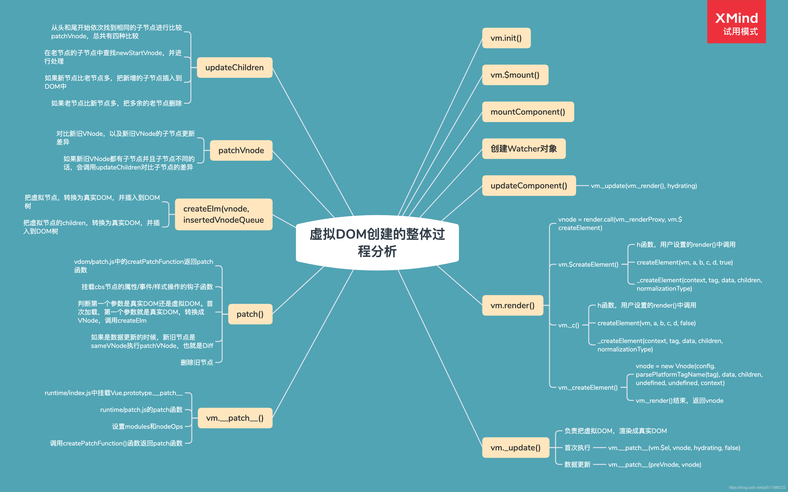

# Vue源码分析
## 虚拟DOM
### 概念
- 虚拟DOM就是使用JavaScript对象描述真实DOM
- Vue中的虚拟DOM借鉴Snabbdom，并添加了Vue的特性，例如指令和组件机制

### 使用原因
- 避免直接操作DOM，提高开发效率
- 作为一个中间层可以跨平台
- 虚拟DOM不一定可以提高性能
  - 首次渲染的时候会增加开销
  - 复杂视图情况下提升渲染性能

### h函数
- vm.$createElement(tag, data, children, normalizeChildren)
  - tag：标签名称或者组件对象
  - data：描述tag，可以设置DOM的属性或者标签的属性
  - children：tag中的文本内容或者子节点
- h函数的返回结果 – VNode
  - VNode的核心属性：
    - tag
    - data
    - children
    - text
    - elm
    - key

### 虚拟DOM整体分析
