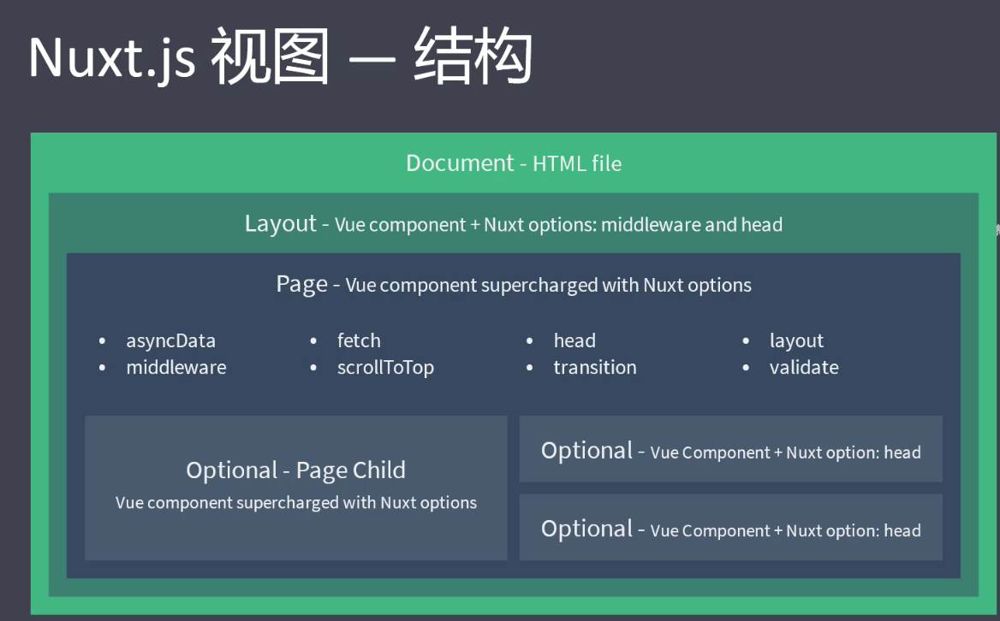

# Nuxt
## Nuxt 概述
- 官网：https://zh.nuxtjs.org/
- GitHub 仓库：https://github.com/nuxt/nuxt.js
- 是一个基于 Vue.js 的服务端渲染应用框架，它可以帮我们轻松的实现同构应用

### 使用方式
- 初始化项目
- 已有的 Node.js 服务端项目
    - 直接把 Nuxt 当做一个中间件集成到 Node Web Server 中
- 现有的 Vue.js 项目
    - 非常熟悉 Nuxt.js
    - 至少百分之10的代码改动

### 创建项目
- 准备
    - 创建示例项目
    - 进入示例项目目录中
    - 初始化 package.json 文件: npm init -y 
    - 安装 nuxt: npm innstall nuxt
    - 在 package.json 文件的 scripts 中新增：
    ```
    // 可以通过运行 npm run dev 来运行 nuxt
    "scripts": { 
        "dev": "nuxt" 
    },
    ```
- 创建页面并启动项目
    - 创建 pages 目录: 创建第一个页面 pages/index.vue
    ```
    <template>
        <div>
            <h1>test</h1>
        </div>
    </template>

    <script>
    export default {
        name: 'HomePage'
    }
    </script>

    <style>

    </style>
    ```
- 启动项目：npm run dev

## Nuxt 路由
- Nuxt.js 依据 pages 目录结构自动生成 vue-router 模块的路由配置

### 基础路由
- 假设 pages 的目录结构如下：
```
pages/ 
--| user/ 
-----| index.vue 
-----| one.vue 
--| index.vue
```
- 那么，Nuxt.js 自动生成的路由配置如下：
```
router: { 
    routes: [ 
        { 
            name: 'index', 
            path: '/', 
            component: 'pages/index.vue' 
        },
        { 
            name: 'user', 
            path: '/user', 
            component: 'pages/user/index.vue' 
        },
        { 
            name: 'user-one', 
            path: '/user/one', 
            component: 'pages/user/one.vue' 
        } 
    ] 
}
```

### 路由导航
- a标签
    - 它会刷新整个页面，不推荐使用
    - <a href="/">首页</a>
- nuxt-link组件
    - https://router.vuejs.org/zh/api/#router-link-props
    - <router-link to="/">首页</router-link>
- 编程式导航
    - https://router.vuejs.org/zh/guide/essentials/navigation.html
    - <button @click="onClick">首页</button>
    ```
    methods: {
        onClick () {
            this.$router.push('/')
        }
    }
    ```

### 动态路由
- 在 Nuxt.js 里面定义带参数的动态路由，需要创建对应的以下划线作为前缀的 Vue 文件 或 目录
```
pages/ 
--| _slug/ 
-----| comments.vue 
-----| index.vue 
--| users/ 
-----| _id.vue 
--| index.vue

// Nuxt.js 生成对应的路由配置表为
router: { 
    routes: [ 
        { 
            name: 'index', 
            path: '/', 
            component: 'pages/index.vue' 
        },
        { 
            name: 'users-id', 
            path: '/users/:id?', 
            component: 'pages/users/_id.vue' 
        },
        { 
            name: 'slug', 
            path: '/:slug', 
            component: 'pages/_slug/index.vue' 
        },
        { 
            name: 'slug-comments', 
            path: '/:slug/comments', 
            component: 'pages/_slug/comments.vue' 
        } 
    ] 
}

// 比如这里获取到这里的动态路由参数id
<div>{{ $route.params.id }}</div>
```
- 你会发现名称为 users-id 的路由路径带有 :id? 参数，表示该路由是可选的
    - 如果你想将它设置为必选的路由，需要在 users/_id 目录内创建一个 index.vue 文件

### 嵌套路由
- Vue Router 嵌套路由
    - https://router.vuejs.org/zh/guide/essentials/nested-routes.html
- Nuxt.js嵌套路由
    - https://www.nuxtjs.cn/guide/routing
- 创建内嵌子路由，你需要添加一个 Vue 文件，同时添加一个与该文件同名的目录用来存放子视图组件
    - 别忘了在父组件( .vue 文件) 内增加 <nuxt-child/> 用于显示子视图内容
```
pages/
--| users/
-----| _id.vue
-----| index.vue
--| users.vue

// Nuxt.js 自动生成的路由配置如下：
router: {
  routes: [
    {
      path: '/users',
      component: 'pages/users.vue',
      children: [
        {
          path: '',
          component: 'pages/users/index.vue',
          name: 'users'
        },
        {
          path: ':id',
          component: 'pages/users/_id.vue',
          name: 'users-id'
        }
      ]
    }
  ]
}
```

### 路由配置
- https://zh.nuxtjs.org/api/configuration-router
- 在项目根目录下创建nuxt.config.js
```
// Nuxt.js 配置文件
module.exports = {
    router: {
        base: '/home',
        // routes就是路由配置表，是个数组
        // resolve是解析路由路径的
        extendRoutes(routes, resolve) {
            routes.push({
              name: 'hello',
              path: '/hello',
              component: resolve(__dirname, 'pages/about.vue')
            })
        }
    }
}
```

## Nuxt 视图


### 模板
- 可以定制化 Nuxt.js 默认的应用模板
    - 只需要在 src 文件夹下（默认是应用根目录）创建一个 app.html 的文件
```
<!DOCTYPE html>
<html {{ HTML_ATTRS }}>
  <head {{ HEAD_ATTRS }}>
    {{ HEAD }}
  </head>
  <body {{ BODY_ATTRS }}>
    {{ APP }}
  </body>
</html>
```

### 布局
- Nuxt.js 允许你扩展默认的布局，或在 layout 目录下创建自定义的布局
- 可通过添加 layouts/default.vue 文件来扩展应用的默认布局
    - 别忘了在布局文件中添加 <nuxt/> 组件用于显示页面的主体内容
    ```
    <template>
        <div>
            <h1>layouts</h1>
            <nuxt />
        </div>
    </template>

    <script>
    export default {
        
    }
    </script>

    <style>

    </style>
    ```

### asyncData
- https://zh.nuxtjs.org/guide/async-data
- Nuxt.js 扩展了 Vue.js，增加了一个叫 asyncData 的方法，使得我们可以在设置组件的数据之前能异步获取或处理数据
```
<template>
    <div>
        <h1>首页</h1>
        <h1>{{ title }}</h1>
    </div>
</template>

<script>
import axios from 'axios'

export default {
    name: 'HomePage',
    async asyncData() {
        const res = await axios({
            method: 'GET',
            // 这里的请求地址要写完整，因为在服务端渲染期间，也要来请求数据，不写完整的话服务端渲染就会走到80端口
            // 如果只是客户端渲染，就会以3000端口为基准来请求根目录下的data.json，服务端渲染就默认走到80了
            url: 'http://localhost:3000/data.json'
        })
        // 返回的数据会与data中的数据混合
        return res.data
    },
}
</script>

<style>

</style>
```
- 它会将 asyncData 返回的数据融合组件 data 方法返回数据一并给组件
- 调用时机：服务端渲染期间和客户端路由更新之前（保证了服务端和客户端都要运行处理数据）
- 注意事项：
    - 只能在页面组件中使用，非页面组件中不会调用 asyncData 方法，如果子组件中需要数据，可以通过 props 方式传递数据
    - 没有 this，因为它是在组件初始化之前被调用的
- 当想要动态页面内容有利于 SEO 或者是提升首屏渲染速度的时候，就在 asyncData 中发送请求数据
    - 如果是非异步数据或者普通数据，则正常的初始化到 data 中即可

### 上下文对象
- https://www.nuxtjs.cn/guide/async-data
```
async asyncData (context) {
<template>
    <div>
        <h1>user page</h1>
        <div>{{ $route.params.id }}</div>
    </div>
</template>

<script>
export default {
    name: 'UserPage',
    async asyncData (context) {
        // asyncData 的参数为上下文对象，我们无法在这个方法里使用 this
        // 所以无法通过 this.$router.params.id 拿到路由参数，但是可以通过 context.params.id 获取参数
        console.log(context, context.params.id) 
    }
}
</script>

<style>

</style>
```