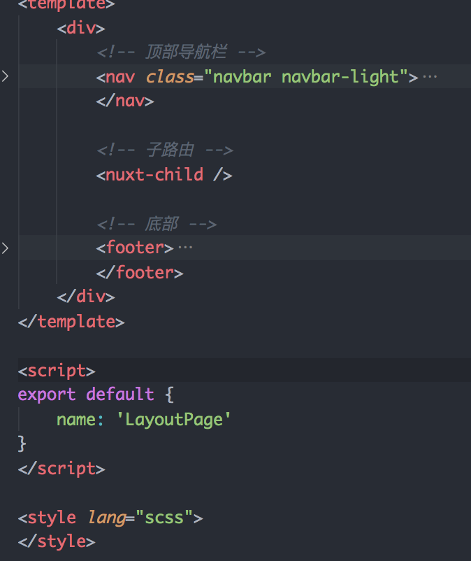

# Nuxt 案例
## 项目地址
- GitHub仓库：https://github.com/gothinkster/realworld
- 在线实例：https://demo.realworld.io/
- 接口文档：https://github.com/gothinkster/realworld/tree/master/api
- 页面模板：https://github.com/gothinkster/realworld-starter-kit/blob/master/FRONTEND_INS
TRUCTIONS.md


## 发布部署
### 使用命令打包
- https://zh.nuxtjs.org/guide/commands
- nuxt
    - 启动一个热加载的 Web 服务器（开发模式） localhost:3000
- nuxt build
    - 利用 webpack 编译应用，压缩 JS 和 CSS 资源（发布用）
- nuxt start
    - 以生产模式启动一个 Web 服务器 (需要先执行nuxt build)
- nuxt generate
    - 编译应用，并依据路由配置生成对应的 HTML 文件 (用于静态站点的部署)

### 最简单的部署方式
- 配置Host + Port
```
// nuxt.config.js
server: {
    host: '0.0.0.0',// 监听所有外网地址。在生产环境服务器上外网环境就能访问到了，在本地的话，局域网都能访问到了
    port: 3000
}
```
- 压缩发布包
    - .nuxt文件夹（Nuxt打包生成的资源文件）
    - static文件夹（项目中的静态资源）
    - nuxt.config.js（给Nuxt服务来使用的）
    - package.json （因为在服务端要安装第三方包）
    - yarn.lock（因为在服务端要安装第三方包）
- 将发布包传到服务端
    - 登录服务器：ssh root@118.25.24.162
    - 选择一个目录创建一个 nuxt-realword 文件夹：mkdir nuxt-realword
    - cd nuxt-realword 进入该文件夹， 然后使用 pwd 打印当前文件夹路径
    - 回到本地，使用 scp 命令往服务器传压缩包：scp 本地文件路径 root@118.25.24.162:服务端文件夹路径
- 解压
    - 回到服务器的 nuxt-realword 文件夹里，此时已经有了一个 nuxt-realword.zip 文件，执行unzip nuxt-realword.zip 对压缩包解压
    - 然后使用 ls -a 查看解压后的所有文件
- 安装依赖
    - npm install
- 启动服务
    - npm run start
    - 访问 118.25.24.162:3000

## 项目初始化
- 新建项目文件
- npm init -y 初始化 package.json
- npm install nuxt 安装 nuxt 依赖
- 在 package.json 中添加启动脚本
```
"scripts": { 
    "dev": "nuxt" 
}
```
- 创建 pages/index.vue
```
<template>
    <div>
        <h1>test</h1>
    </div>
</template>

<script>

export default {
  
}

</script>

<style lang="scss">

</style>
```
- npm run dev 启动服务

## 导入样式资源
- 创建 app.html
```
<!DOCTYPE html>
<html {{ HTML_ATTRS }}>
<head {{ HEAD_ATTRS }}>
    {{ HEAD }}
    <!-- Import Ionicon icons & Google Fonts our Bootstrap theme relies on -->
    <link href="https://cdn.jsdelivr.net/npm/ionicons@2.0.1/css/ionicons.min.css" rel="stylesheet" type="text/css">
    <link
        href="//fonts.googleapis.com/css?family=Titillium+Web:700|Source+Serif+Pro:400,700|Merriweather+Sans:400,700|Source+Sans+Pro:400,300,600,700,300italic,400italic,600italic,700italic"
        rel="stylesheet" type="text/css">
    <!-- Import the custom Bootstrap 4 theme from our hosted CDN -->
    <!-- <link rel="stylesheet" href="//demo.productionready.io/main.css"> -->
    <link rel="stylesheet" href="/index.css">
</head>
<body {{ BODY_ATTRS }}>
    {{ APP }}
</body>
</html>
```

## 布局组件
- 创建 pages/layout/index.vue

- 重新路由表：创建 nuxt.config.js
```
// Nuxt.js 配置文件
export default {
    router: {
        // 自定义路由表规则
        extendRoutes (routes, resolve) {
            // 清除 Nuxt.js 基于 pages 目录默认生成的路由表规则
            routes.splice(0)

            routes.push(
                ...[
                    {
                        path: '/',
                        component: resolve(__dirname, 'pages/layout'),
                        children: [
                            {
                                path: '', // 默认子路由
                                name: 'home',
                                component: resolve(__dirname, 'pages/home')
                            }
                        ]
                    }
                ]
            )
        }
    }
}
```

## 导入登录注册页面以及剩余页面
- 创建 pages/login/index.vue