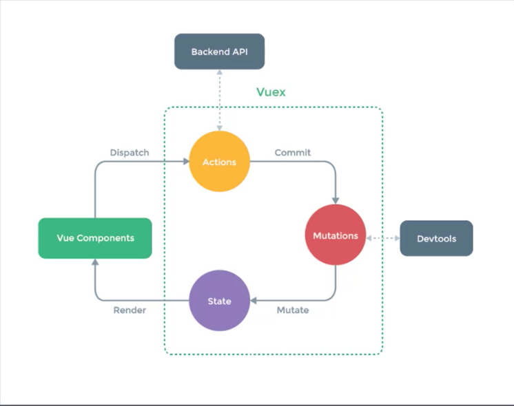

# Vuex状态管理
## 状态管理
- state，驱动应用的数据源；
- view，以声明方式将 state 映射到视图；
- actions，响应在 view 上的用户输入导致的状态变化

## 组件通信方式
### 父传子
- 子组件通过props接受数据
```
<blog-post title="My journey with Vue"></blog-post>

Vue.component('blog-post', { props: ['title'], template: '<h3>{{ title }}</h3>' })
```

### 子传父
- 在子组件中使用 $emit 发布一个自定义事件
```
<button v-on:click="$emit('enlargeText', 0.1)"> Enlarge text </button>
```
- 父组件在使用这个组件的时候，使用 v-on 监听这个自定义事件
```
<blog-post v-on:enlargeText="hFontSize += $event"></blog-post>
```

### 非父子组件
- 通过事件中心eventbus触发和注册事件
```
// eventbus.js :
export default new Vue()
```
- 在需要通信的两端，使用 $on 订阅，使用 $emit 发布
```
// 没有参数 
bus.$on('自定义事件名称', () => { 
    // 执行操作 
})
// 有参数 
bus.$on('自定义事件名称', data => { 
    // 执行操作 
})

// 没有自定义传参 
bus.$emit('自定义事件名称'); 
// 有自定义传参 
bus.$emit('自定义事件名称', 数据);
```

### 父直接访问子组件
- 通过 ref 获取子组件
    - 如果你把它作用到普通 HTML 标签上，则获取到的是 DOM
    - 如果你把它作用到组件标签上，则获取到的是组件实例
```
// 创建 base-input 组件
<template> 
    <input ref="input"> 
</template> 
<script> 
    export default { 
        methods: { 
            // 用来从父级组件聚焦输入框 
            focus: function () { 
                this.$refs.input.focus() 
            } 
        } 
    } 
</script>

// 在使用子组件的时候，添加 ref 属性
<base-input ref="usernameInput"></base-input>

// 在父组件等渲染完毕后使用 $refs 访问
mounted () { 
    this.$refs.usernameInput.focus() 
}
```
- $refs 只会在组件渲染完成之后生效，并且它们不是响应式的。这仅作为一个用于直接操作子组件的“逃生舱”——你应该避免在模板或计算属性中访问 $refs

## Vuex
### 概念
- Vuex是专门为Vue.js设计的状态管理库
- Vuex采用集中式的方式存储需要共享的状态
- Vuex的作用是进行状态管理，解决复杂组件通信，数据共享
- Vuex集成到了devtools中，提供了time-travel时光旅行历史回滚功能

### 使用场景
- 大型的单页应用
    - 多个视图依赖于同一状态
    - 来自不同视图的行为需要变更同一状态

### 核心概念

- Store：是一个容器，包含着应用中的大部分状态，不能直接改变store中的状态，要通过mutation的方式改变状态。
    - 定义store
    ```
    import Vue from 'vue'
    import Vuex from 'vuex'

    Vue.use(Vuex)

    export default new Vuex.Store({
    state: {},
    mutations: {},
    actions: {},
    modules: {}
    })
    ```
    - 注入store
    ```
    import store from './store'

    new Vue({
    router,
    store,
    render: h => h(App)
    }).$mount('#app')
    ```
- State：是状态，保存在Store中，因为Store是唯一的，所以State也是唯一的，也称为单一状态树。这里的状态是响应式的。
    - 使用 mapState 简化 State 在视图中的使用，mapState 返回计算属性
        - 接收数组参数
        ```
        // 该方法是 vuex 提供的，所以使用前要先导入 
        import { mapState } from 'vuex' 
        // mapState 返回名称为 count 和 msg 的计算属性 
        // 在模板中直接使用 count 和 msg 
        computed: { 
            ...mapState(['count', 'msg']), 
        }
        ```
        - 接收对象参数，如果当前视图中已经有了 count 和 msg，如果使用上述方式的话会有命名冲突
        ```
        // 该方法是 vuex 提供的，所以使用前要先导入 
        import { mapState } from 'vuex' 
        // 通过传入对象，可以重命名返回的计算属性 
        // 在模板中直接使用 num 和 message 
        computed: { 
            ...mapState({ 
                num: state => state.count, 
                message: state => state.msg 
            }) 
        }
        ```
- Getter：是Vuex中的计算属性，方便从一个属性派生出其他的值。它内部会对计算的属性进行缓存，只有当依赖改变的时候，才会重新进行计算。
    - 使用 mapGetter 简化视图中的使用
    ```
    import { mapGetter } from 'vuex' 
    computed: { 
        ...mapGetter(['reverseMsg']), 
        // 改名，在模板中使用 reverse 
        ...mapGetter({ reverse: 'reverseMsg' }) 
    }
    ```
- Mutation：状态的变换必须要通过提交Mutation来完成。
    - 使用 Mutation 改变状态的好处是，集中的一个位置对状态修改，不管在什么地方修改，都可以追踪到状态的修改
    ```
    import { mapMutations } from 'vuex' 
    methods: { 
        ...mapMutations(['increate']), 
        // 传对象解决重名的问题 
        ...mapMutations({ increateMut: 'increate' }) 
    }
    ```
- Action：和MuTation类似，不同的是Action可以进行异步的操作，内部改变状态的时候，都需要提交Mutation。
    ```
    import { mapActions } from 'vuex' 
    methods: { 
        ...mapActions(['increate']), 
        // 传对象解决重名的问题 
        ...mapActions({ increateAction: 'increate' })
    }
    ```
- Module：当Store太过臃肿时，可以将Store分成多个模块，每个模块里有State、Mutation、Action、Getter，甚至是子模块。
```
import Vue from 'vue'
import Vuex from 'vuex'
import products from './modules/products'
import cart from './modules/cart'

Vue.use(Vuex)

export default new Vuex.Store({
  strict: process.env.NODE_ENV !== 'production',
  state: {
    count: 0,
    msg: 'Hello Vuex'
  },
  getters: {
    reverseMsg (state) {
      return state.msg.split('').reverse().join('')
    }
  },
  mutations: {
    increate (state, payload) {
      state.count += payload
    }
  },
  actions: {
    increateAsync (context, payload) {
      setTimeout(() => {
        context.commit('increate', payload)
      }, 2000)
    }
  },
  modules: {
    products,
    cart
  }
})
```