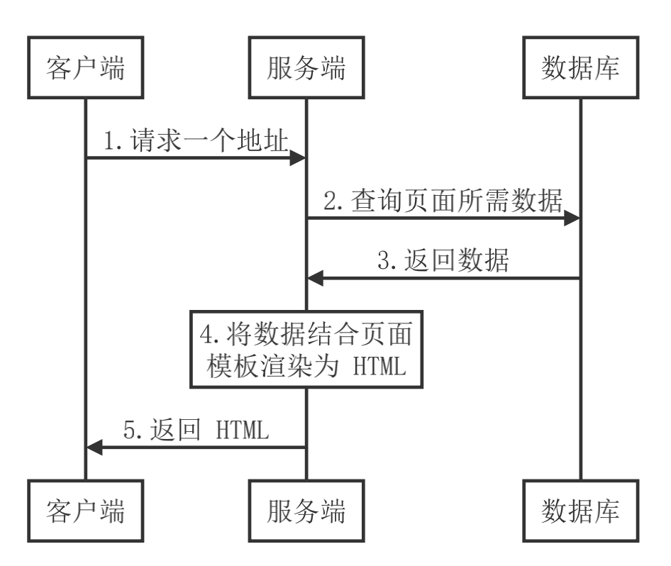
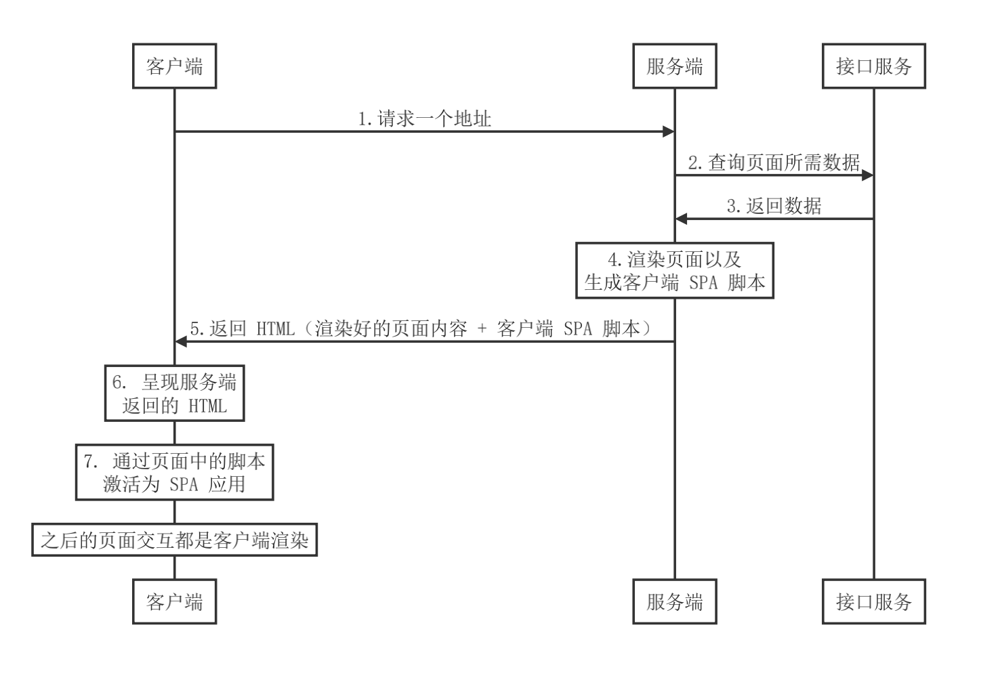

# 服务端渲染
## 概述
### 基于客户端渲染的前端框架
- Angular
- React
- Vue

### SPA 单页应用
- 优点
    - 用户体验好
    - 开发效率高
    - 渲染性能好
    - 可维护性
- 缺点
    - 首屏渲染时间长
    - 不利于SEO

### 借鉴传统的服务器渲染

### 客户端激活为SPA

### 同构应用
- 通过服务端渲染首屏直出，解决SPA应用首屏渲染慢以及不利于SEO问题
- 通过客户端渲染结果页面内容交互得到更好的用户体验
- 这种方式通常称之为现代化的服务端渲染，也叫同构渲染
- 这种方式构建的应用称之为服务端渲染应用或者是同构应用

## 传统的服务端渲染
- 缺点：
    - 前后端代码完全耦合在一起，不利于开发和维护
    - 前端没有足够发挥空间
    - 服务端压力大
    - 用户体验一般
