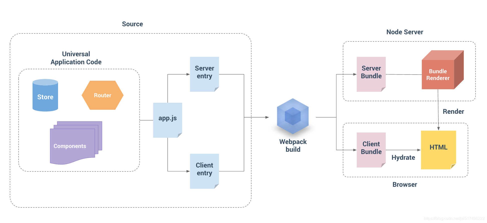

# 搭建自己的服务端渲染（SSR）
## 渲染一个 Vue 实例
```bash
mkdir vue-ssr
cd vue-ssr
yarn init -y
yarn add vue vue-server-renderder
```
- 创建 server.js
```js
const Vue = require('vue')
const renderer = require('vue-server-renderer').createRenderer()

const app = new Vue({
    template:  `
        <div id="app">
            <h1>{{ message }}</h1>
        </div>
    `,
    data: {
        message: '哈哈哈哈'
    }
})

renderer.renderToString(app, (err,html) => {
    if (err) throw err
    console.log(html)
})
```
- node server.js，运行结果：
    - data-server-rendered="true"这个属性是为了将来客户端渲染激活接管的接口
```js
<div id="app" data-server-rendered="true"><h1>哈哈哈哈</h1></div>
```

## 结合到 Web 服务中
```bash
yarn add express
```
- server.js：
```js
const Vue = require('vue')
const express = require('express')

const renderer = require('vue-server-renderer').createRenderer()

const server = express()

server.get('/', (req, res) => {
    const app = new Vue({
        template:  `
            <div id="app">
                <h1>{{ message }}</h1>
            </div>
        `,
        data: {
            message: '哈哈哈哈'
        }
    })
    
    renderer.renderToString(app, (err,html) => {
        if (err) {
            return res.status(500).end('Internet Server Error')
        }
        // 设置编码，防止乱码
        res.setHeader('Content-Type', 'text/html; charset=utf8') 
        // res.end(html)
        res.end(
            `
            <!DOCTYPE html>
            <html lang="en">
            <head>
                <meta charset="UTF-8">
                <meta name="viewport" content="width=device-width, initial-scale=1.0">
                <title>Document</title>
            </head>
            <body>
                ${html}
            </body>
            </html>
            `
        )
    })
})

server.listen(3000, () => {
    console.log('server running at port 3000')
})
```

## 使用 HTML 模板
- 创建模板文件：index.template.html
```html
<!DOCTYPE html>
<html lang="en">

<head>
    <meta charset="UTF-8">
    <meta name="viewport" content="width=device-width, initial-scale=1.0">
    <title>Document</title>
</head>

<body>
    <!--vue-ssr-outlet-->
</body>

</html>
```
> `<!--vue-ssr-outlet-->`是占位符，为了接收将来要渲染的变量，不能写错，不能有多余的空格
- server.js 中 createRenderer 方法指定模板文件
```js
const fs = require('fs')

const renderer = require('vue-server-renderer').createRenderer({
    // 指定模板文件
    template: fs.readFileSync('./index.template.html', 'utf-8')
})
```

## 在模板中使用外部数据
- index.template.html
```html
<!DOCTYPE html>
<html lang="en">

<head>
    <meta charset="UTF-8">
    <meta name="viewport" content="width=device-width, initial-scale=1.0">
    {{{ meta }}}
    <title>{{ title }}</title>
</head>

<body>
    <!--vue-ssr-outlet-->
</body>

</html>
```
> 使用两个花括号可以写入外部数据变量，而标签也会进行转义后输出在页面上；此时可以使用三个花括号原样输出数据，不会对标签进行转义处理
- 在 server.js 代码中给 renderer.renderToString 增加第二个参数为外部数据对象
```js
renderer.renderToString(app, {
    title: '拉勾教育',
    meta: `
      <meta name="description" content="拉勾教育" >
    `
  }, (err, html) => {
    if (err) {
      return res.status(500).end('Internal Server Error.')
    }
    // 设置编码，防止乱码
    res.setHeader('Content-Type', 'text/html; charset=utf8') 
    res.end(html)
  })

```
## 构建配置


### 源码结构
```bash
src
├── components
│   ├── Foo.vue
│   ├── Bar.vue
│   └── Baz.vue
├── App.vue
├── app.js # 通用 entry(universal entry)
├── entry-client.js # 仅运行于浏览器
└── entry-server.js # 仅运行于服务器
```
- App.vue
```js
<template>
    <div id="app">
        <h1>{{ message }}</h1>
        <h3>客户端动态交互</h3>
        <div>
            <input v-model="message">
        </div>
        <div>
            <button @click="onClick">点击测试</button>
        </div>
    </div>
</template>

<script>
export default {
    name: 'App',
    data () {
        return {
            message: '哈哈哈哈'
        }
    },
    methods: {
        onClick () {
            console.log('click')
        }
    }
}
</script>
```
- app.js ---是我们应用程序的「通用 entry」。在纯客户端应用程序中，我们将在此文件中创建根 Vue 实例，并直接挂载到 DOM。但是，对于服务器端渲染(SSR)，责任转移到纯客户端 entry 文件。app.js 简单地使用 export 导出一个 createApp 函数：
```js
// 通用启动入口
import Vue from 'vue'
import App from './App.vue'

// 导出一个工厂函数，用于创建新的
// 应用程序、router 和 store 实例
export function createApp() {
    const app = new Vue({
        // 根实例简单的渲染应用程序组件。
        render: h => h(App)
    })
    return { app }
}
```
- entry-client.js 客户端 entry 只需创建应用程序，并且将其挂载到 DOM 中：
```js
// 客户端入口
import { createApp } from './app'

// 客户端特定引导逻辑……

const { app } = createApp()

// 这里假定 App.vue 模板中根元素具有 `id="app"`
app.$mount('#app')
```
- entry-server.js 服务器 entry 使用 default export 导出函数，并在每次渲染中重复调用此函数。此时，除了创建和返回应用程序实例之外，它不会做太多事情 - 但是稍后我们将在此执行服务器端路由匹配 (server-side route matching) 和数据预取逻辑 (data pre-fetching logic)
```js
// 服务端启动入口
import { createApp } from './app'

export default context => {
    const { app } = createApp()
    return app
}
```

### 安装依赖
- 安装生产依赖： 
```bash
yarn add vue vue-server-renderer express cross-env
```

| 包                         | 说明                             | 
| :------------              | :-----------------               | 
| vue                        | Vue.js核心库                     | 
| vue-server-renderer        | Vue服务端渲染工具                | 
| express                    | 基于Node的webpack服务框架        | 
| cross-env                  | 通过npm scripts设置跨平台环境变量 | 

- 安装开发依赖：
```bash
yarn add -D webpack webpack-cli webpack-merge webpack-node-externals @babel/core @babel/plugin-transform-runtime @babel/preset-env babel-loader css-loader url-loader file-loader rimraf vue-loader vue-template-compiler friendly-errors-webpack-plugin
```

| 包                              | 说明                              | 
| :------------                   | :-----------------                | 
| webpack                         | webpack核心包                     | 
| webpack-cli                     | webpack的命令行工具                | 
| webpack-merge                   | webpack配置信息合并工具            | 
| webpack-node-externals          | 排除webpack中的Node模块            |
| rimraf	                      | 基于Node封装的一个跨平台rm -rf工具  |
| friendly-errors-webpack-plugin  |	友好的webpack错误提示               |
| @babel/core<br>@babel/plugin-transform-runtime<br>@babel/preset-env<br>babel-loader  | Babel相关工具
| vue-loader<br>vue-template-compiler	|   处理.vue资源
| file-loader	                  | 处理字体资源
| css-loader	                  | 处理CSS资源
| url-loader	                  | 处理图片资源

### webpack配置文件及打包命令
- 初始化 webpack 打包配置文件
```bash
build
|---webpack.base.config.js # 公共配置
|---webpack.client.config.js # 客户端打包配置文件
|---webpack.server.config.js # 服务端打包配置文件
```
- webpack.base.config.js
```js
/**
 * 公共配置
 */
const VueLoaderPlugin = require('vue-loader/lib/plugin')
const path = require('path')
const FriendlyErrorsWebpackPlugin = require('friendly-errors-webpack-plugin')
const resolve = file => path.resolve(__dirname, file)

const isProd = process.env.NODE_ENV === 'production'

module.exports = {
  mode: isProd ? 'production' : 'development',
  output: {
    path: resolve('../dist/'),
    publicPath: '/dist/',
    filename: '[name].[chunkhash].js'
  },
  resolve: {
    alias: {
      // 路径别名，@ 指向 src
      '@': resolve('../src/')
    },
    // 可以省略的扩展名
    // 当省略扩展名的时候，按照从前往后的顺序依次解析
    extensions: ['.js', '.vue', '.json']
  },
  devtool: isProd ? 'source-map' : 'cheap-module-eval-source-map',
  module: {
    rules: [
      // 处理图片资源
      {
        test: /\.(png|jpg|gif)$/i,
        use: [
          {
            loader: 'url-loader',
            options: {
              limit: 8192,
            },
          },
        ],
      },

      // 处理字体资源
      {
        test: /\.(woff|woff2|eot|ttf|otf)$/,
        use: [
          'file-loader',
        ],
      },

      // 处理 .vue 资源
      {
        test: /\.vue$/,
        loader: 'vue-loader'
      },

      // 处理 CSS 资源
      // 它会应用到普通的 `.css` 文件
      // 以及 `.vue` 文件中的 `<style>` 块
      {
        test: /\.css$/,
        use: [
          'vue-style-loader',
          'css-loader'
        ]
      },
      
      // CSS 预处理器，参考：https://vue-loader.vuejs.org/zh/guide/pre-processors.html
      // 例如处理 Less 资源
      // {
      //   test: /\.less$/,
      //   use: [
      //     'vue-style-loader',
      //     'css-loader',
      //     'less-loader'
      //   ]
      // },
    ]
  },
  plugins: [
    new VueLoaderPlugin(),
    new FriendlyErrorsWebpackPlugin()
  ]
}
```
- webpack.client.config.js
```js
/**
 * 客户端打包配置
 */
const { merge } = require('webpack-merge')
const baseConfig = require('./webpack.base.config.js')
const VueSSRClientPlugin = require('vue-server-renderer/client-plugin')

module.exports = merge(baseConfig, {
  entry: {
    app: './src/entry-client.js'
  },

  module: {
    rules: [
      // ES6 转 ES5
      {
        test: /\.m?js$/,
        exclude: /(node_modules|bower_components)/,
        use: {
          loader: 'babel-loader',
          options: {
            presets: ['@babel/preset-env'],
            cacheDirectory: true,
            plugins: ['@babel/plugin-transform-runtime']
          }
        }
      },
    ]
  },

  // 重要信息：这将 webpack 运行时分离到一个引导 chunk 中，
  // 以便可以在之后正确注入异步 chunk。
  optimization: {
    splitChunks: {
      name: "manifest",
      minChunks: Infinity
    }
  },

  plugins: [
    // 此插件在输出目录中生成 `vue-ssr-client-manifest.json`。
    new VueSSRClientPlugin()
  ]
})
```
- webpack.server.config.js
```js
/**
 * 服务端打包配置
 */
const { merge } = require('webpack-merge')
const nodeExternals = require('webpack-node-externals')
const baseConfig = require('./webpack.base.config.js')
const VueSSRServerPlugin = require('vue-server-renderer/server-plugin')

module.exports = merge(baseConfig, {
  // 将 entry 指向应用程序的 server entry 文件
  entry: './src/entry-server.js',

  // 这允许 webpack 以 Node 适用方式处理模块加载
  // 并且还会在编译 Vue 组件时，
  // 告知 `vue-loader` 输送面向服务器代码(server-oriented code)。
  target: 'node',

  output: {
    filename: 'server-bundle.js',
    // 此处告知 server bundle 使用 Node 风格导出模块(Node-style exports)
    libraryTarget: 'commonjs2'
  },

  // 不打包 node_modules 第三方包，而是保留 require 方式直接加载
  externals: [nodeExternals({
    // 白名单中的资源依然正常打包
    allowlist: [/\.css$/]
  })],

  plugins: [
    // 这是将服务器的整个输出构建为单个 JSON 文件的插件。
    // 默认文件名为 `vue-ssr-server-bundle.json`
    new VueSSRServerPlugin()
  ]
})
```